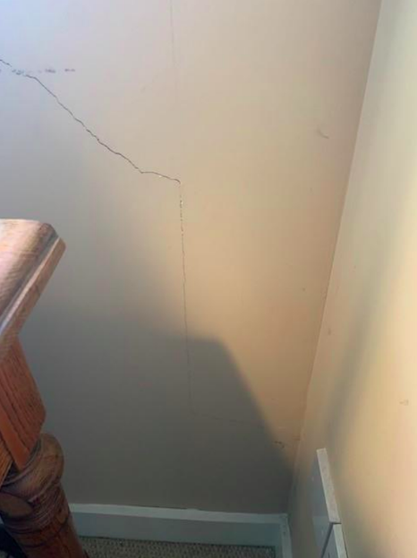
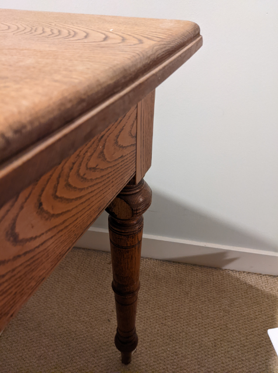

# 2nd, 3rd Floor Landing
---
**Although the Report identifies zig zag cracks as being present and shows a photograph which was thought to be the stairs, it is actually bedroom 1**

- The vertical hairline cracks which are described as not extending to ceiling or the floor actually do **(insert photograph)**
- Mr Armour’s assertion the cracks which follow the wall stringer on the stairs were actually paint lines rather than cracks were dismissed as spurious by our surveyor on his 2nd visit.  He also dismissed Mr Armour’s explanation that:-   *“over time, the weight of persons will allow the timber to flex and open up the paint lines. In our opinion this damage is due to normal usage “*

---
## Issues Surrounding Door Frames

Mr Armour's Statement | Description | Image 
:---  | :---        | ---:
Omitted/Development | _**2nd, 3rd Floor Landing: Master Bedroom door**_    A small crack in the plasterboard above the door frame on the right.   **Development** there are now slight gaps in the timber (*Mr Armour dismissed our movement hypothesis as there were previously NO gaps in the timber*) | <a href="https://drive.google.com/uc?export=view&id=18q5YlcIIeJyvAfydAEd4UMA1lkWLhTjG"><a href="https://drive.google.com/uc?export=view&id=18odg7sSvXC7mnPPXyMHeSWxd0CJmPp6Y"><a href="https://drive.google.com/uc?export=view&id=18qDY5hTEDfkojAN4JmGrtsecsmILmWfE">
Inaccuracy/Development | _**2nd, 3rd Floor Landing: Cupboard Door**_    **Inaccuracy:** we reported that the upstairs cupboard door rubs heavily on the carpet were before it did not - Mr Armour instead reported that the door doesn't engauge with the catch without applying force which is not quite accurate   **Development** there are now slight gaps between the wall and the timber | <a href="https://drive.google.com/uc?export=view&id=1M6jaz-hqqJ85O8FzSc3Q453ttRknOjw3">
Omission | _**2nd, 3rd Floor Landing: Mhairi's Bedroom door**_    **Development???** a slight ridge and a crack have appeared above mhairi's bedroom door frame at on the right and left side respectively at the plasterboard edges - both are vertical | <a href="https://drive.google.com/uc?export=view&id=190uwIjIqa8BwmPyqzTRgq99DOzNnexNx">
Omission | _**2nd, 3rd Floor Landing: Main Bathroom Door**_    **Development** series of vertical fissures in the plasterboard above bathroom door and slight gaps are now visible in the door frame timber | <a href="https://drive.google.com/uc?export=view&id=19-GQHMotaJZzEMJQ26WqdUf9XStEWHVo"><a href="https://drive.google.com/uc?export=view&id=1AgunfQ-qMGSz2wo_Cd5hl7YMx89S-REu">
Omission | _**2nd, 3rd Floor Landing: West Bedroom Door**_    **Development** crack above door frame and slight separation of door frame timber | <a href="https://drive.google.com/uc?export=view&id=18zCahb9VplprLtggUqkCXMPffStPLdwC">
Omission | _**Lower Landing: Livingroom Door**_    **Development** Slight separation of some of the door frame timers and slight cracking/separation of the timer edges from the plasterboard wall - this was not previously visible in the [property brochure](https://drive.google.com/file/d/1-dMsdkqNJyB_b9rbycq3mClOOrub1Pds/view?usp=sharing) | <a href="https://drive.google.com/uc?export=view&id=1BTIG4XsDDFTm878syjNzjuW-gGjeLMNo"><a href="https://drive.google.com/uc?export=view&id=1BQlRDhu4UXx7xlEBjG3Wylw-yIcniRhG">

>TODO:  - Main Door  - Cupboard Door  - WC Door

## Miscellaneous

Mr Armour's Statement | Description | Image 
:---  | :--- | ---:
Mentioned | ridge along gap between plaster board sheets along the ceiling | <a href="https://drive.google.com/uc?export=view&id=18w-ZcD_KsiMWHzG6RW6I_lCWNVNmRUrn">

## Stairs

Mr Armour's Statement | Description | Image 
:---  | :--- | ---:
Mentioned | _**Stairs: Stringers**_    Slight separation of the stair stringer from the central banister wall and a long crack in the plasterboard above the stringer and running parallel to the stringer ...aditionally there is a long paint crack along top of the oppoisite stringer|<a href="https://drive.google.com/uc?export=view&id=199xkMsk8dmX6dT0KWGzGg8THDj8tzTJR"><a href="https://drive.google.com/uc?export=view&id=196qqY7DVHOp-jkvNS6M21WvXXCt22-zJ"><a href="https://drive.google.com/uc?export=view&id=1BBAgzQhd7psAvqOd6zSh8-u1h-pYFyGT">
Omission | _**Stairs: Surrounding Walls 1**_     **Omission:** horizontal ridge w/step between plaster board along the wall from the top of the stairs now prominant due to movement - this was not previously visible in the [property brochure](https://drive.google.com/file/d/1-dMsdkqNJyB_b9rbycq3mClOOrub1Pds/view?usp=sharing) | <a href="https://drive.google.com/uc?export=view&id=174wMtDXjcXZbwgURFDeRi01wuW__7UX3">
Development |  _**Stairs: Surrounding Walls 2**_     **Development:** vertical gaps between plaster board wall now prominant - consistant with movement - this was not previously visible in the [property brochure](https://drive.google.com/file/d/1-dMsdkqNJyB_b9rbycq3mClOOrub1Pds/view?usp=sharing)  _**Mr Armour's report testifies that these are due to recent settlement he previously observed in his report they "did not extend to the ceiling or floor" when now they clearly do**_ | <a href="https://drive.google.com/uc?export=view&id=195bJoUkO1YDlqLxzP7BpupQDfFrl4Hwv"><a href="https://drive.google.com/uc?export=view&id=192vgdBKNDTboNgJ7klb1JRiz8MFyQx3p"><a href="https://drive.google.com/uc?export=view&id=1M9VSnceufocyC-p6BVO_VLh0cPghe7Ia"><a href="https://drive.google.com/uc?export=view&id=1MB_SR-jayq_OmntEnFwhMMKJ2f-Cw_N2">
Omission | _**Stairs: Surrounding Walls 3**_     **Omission:** crack at corner of wall and overhead ceiling above bottom of staircase    **Development:** crack appearing at corner of wall and overhead landing | <a href="https://drive.google.com/uc?export=view&id=18vqAYwcy5sil-1ujgs9Qsy00XWVtupus"><a href="https://drive.google.com/uc?export=view&id=19AipMzKdSXAehQiETdbhrR2AkqLaJ-rL">

## Issue regarding image in report

**Misidentification:** an image of one of the bedrooms is situated in the "Stairs" section of Mr Armour's report. We suspect that the desk in the image might have been confused for a wooden bannister quite different to anything in our flat.  

"Stairs" image in mr armours report | a slightly different perspective of our desk featured in Mr Armour's image
:---:|:---:
|