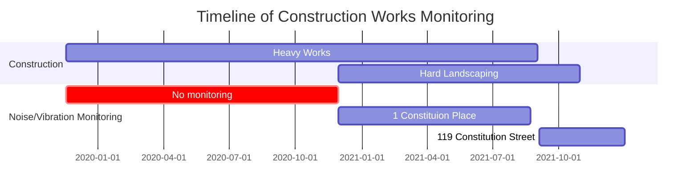

# Issues With Vibration Readings

## Sensor Locations

<a href="https://drive.google.com/uc?export=view&id=17lJ_9KgnOZV-kzYQzUggoVFlNn5mTTh0">

[distances](https://www.openstreetbrowser.org) | 14c Cons. St.| 1 Cons. Pl.| 119 Cons. St.
:--:|:--:|:--:|:--:
14c Cons. St.| - | 160 metre | 404 metre
1 Cons. Pl.| 160 metre | - | 563 meter
119 Cons. St.| 404 metre | 563 meter | -

## Sensor Period

[whale unearthed](https://www.edinburgh.gov.uk/news/article/12893/rare-whale-bones-amongst-historical-discoveries-made-in-tram-project-excavations)

## Data gaps

The sensor data is incomplete – we can see large gaps – we are unsure about smaller gaps

<a href="https://drive.google.com/uc?export=view id=1qVL8qp4ZIky-cqFhk28WOQOrGOPCo-w6">

<a href="https://drive.google.com/uc?export=view&id=1eRexKrd8l8cZmEFtHSftn-3wo1pSfUH1">