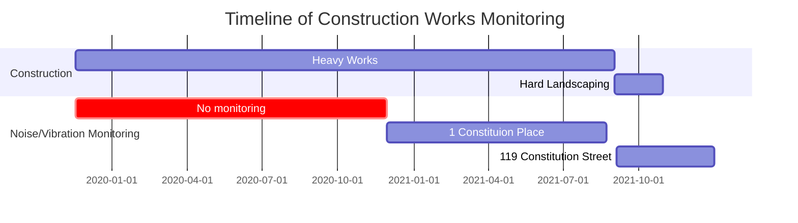

# Issues With Vibration Readings

## Sensor Locations

<a href="https://drive.google.com/uc?export=view&id=17lJ_9KgnOZV-kzYQzUggoVFlNn5mTTh0">

[distances](https://www.openstreetbrowser.org) | 14c Cons. St.| 1 Cons. Pl.| 119 Cons. St.
:--:|:--:|:--:|:--:
14c Cons. St.| - | 160 metre | 404 metre
1 Cons. Pl.| 160 metre | - | 563 meter
119 Cons. St.| 404 metre | 563 meter | -

<!--jumbo jet is 76.3m in length-->

## Sensor Period

[start date](https://www.edinburgh.gov.uk/tramstonewhaven/news/article/27/constitution-street-works-to-start-18-november-2019)
[june 2020](https://edinburghcoun-newsroom.prgloo.com/news/latest-news-rare-whale-bones-amongst-historical-discoveries-in-tram-project-excavations)
[image published on 09/11/2020](https://dailybusinessgroup.co.uk/wp-content/uploads/2020/04/Tram-works-1-constitution-street.png)
[whale unearthed](https://www.edinburgh.gov.uk/news/article/12893/rare-whale-bones-amongst-historical-discoveries-made-in-tram-project-excavations)

## Data gaps

The sensor data is incomplete – we can see large gaps – we are unsure about smaller gaps

<a href="https://drive.google.com/uc?export=view id=1qVL8qp4ZIky-cqFhk28WOQOrGOPCo-w6">

<a href="https://drive.google.com/uc?export=view&id=1eRexKrd8l8cZmEFtHSftn-3wo1pSfUH1">

## Note on vibrational readings

>The reason for the different methodologies is that their works can be different in nature. The majority of the heavy works (breaking out the ground etc) is carried out by Morrison Utility Service and as such [their methodology is to record data on noise and vibration from the different types of machinery used and systems of works, thus making the readings transferable across the route for similar types of works](https://www.edinburgh.gov.uk/tramstonewhaven/faqs/construction-2?documentId=22&categoryId=10#noise%20and%20vibration).  When new machinery or a new method of works commence further readings and data are collected to ensure that they are working within the limits stipulated.  Unannounced and regular audits are undertaken to ensure compliance.

... they're saying that they have located sensors at nominal stations which represent the type of work being conducted in areas with no monitoring.

# Summary

### 0. Access to Data and the situation surrounding data has been inadequate
---
#### 0.1. Misleading Initial Response
initially they issued us with data purporting to show samples taken from a sensor next to 14c Constitution Street - **this is false** in fact the data was from a different street.
#### 0.2. Interference/Cross-over from Loss Adjuster's Actions
the data from the aformentioned sensor only spanned a short period not spanning the duration of the tram works the rationale for the ommission was as follows:   
>Regards why you were initially sent data comprising of only three months of readings, the Service have included that when CTLA initially requested the information from the Council it was noted by the resident that cracks began appearing in the property in March 2021, and CTLA therefore asked the Council to supply Vibration Monitoring Records for 3 months prior to those for March 2021.

Our independant FOI request was affected by CTLA.

### 1. We have No Monitoring Data
---
#### 1.1. Our Building was Not Directly Monitored
There were **NO** sensors monitoring 14c Constitution Street at any point during the construction in accordance with the construction policy and dispite .  The council acknowledge this implicitly and state it was decided to limit the placement of sensors.

Other locations were directly monitored but ours was not...

#### 1.2. Our Building was not Indirectly Monitored

It's stated that Morrison's Utilities claim (and the council accept) that readings from other locations are "transferable" to other sites.  We dispute this;
1. No two sites are identical. The precise work and equipment during demolition and excavation varies considerable depending on the precise environment. The "transferibility" of readings is imprecise as the margin for error is totally unquantifiable 
2. Such a methodology would omits atypical/anomolous vibration events which would cause damage

To support 

- the two data sets we were furnished with which show very different profiles - the work conducted onboth sides is not characteristic of each other - 
- surely a council acquanted with the process would provide us with the data relating to the type of work conducted on our site
- it looks lime they issued us with the full data from the two sensors in closest proximity (geographically)

